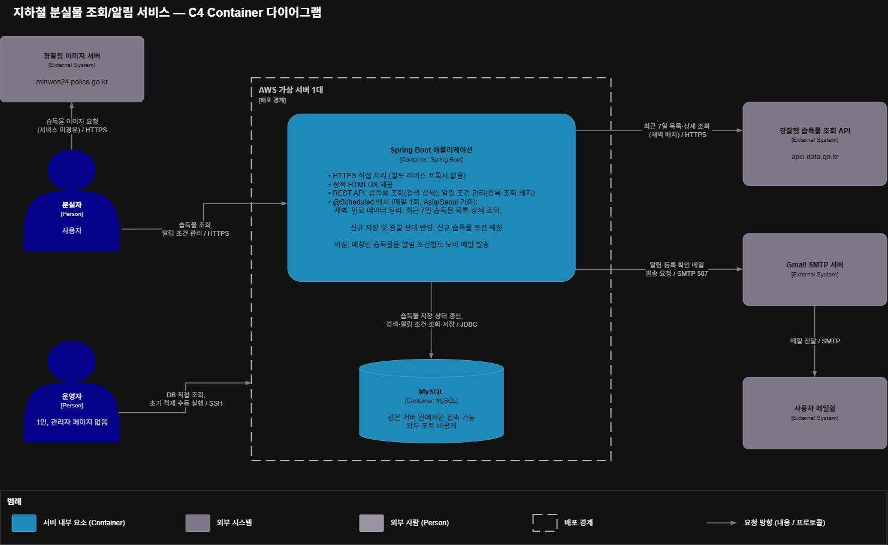
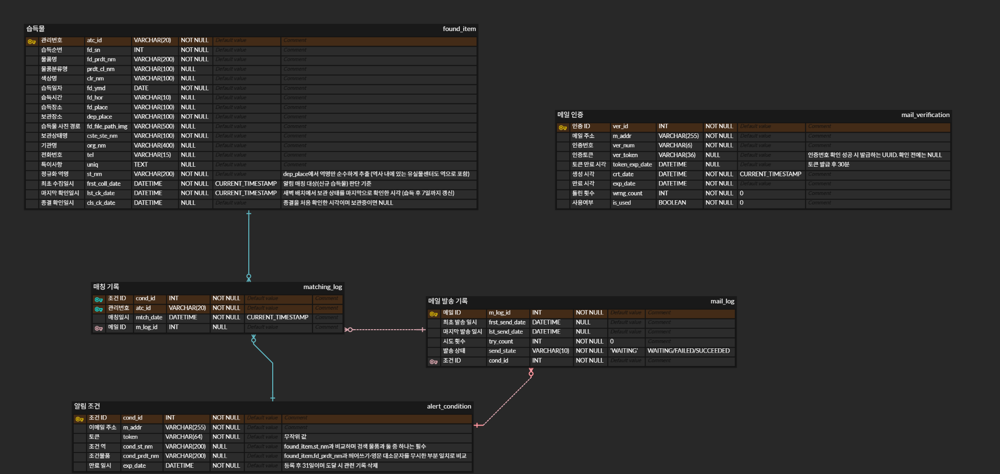

# 지하철 습득물 조회·알림 서비스

지하철에서 잃어버린 물건을 역과 물품명으로 검색하고, 아직 등록되지 않았다면 조건을 걸어두고 메일로 알림을 받는 서비스입니다.

- **개발 기간** 2026.08 ~ 진행 중
- **개발 인원** 1인
- **이전 버전** 

 

## 프로젝트 소개

국가 분실물 포털(LOST112)은 교통수단 구분 없이 통합 검색만 제공합니다. 지하철역에서 사회복무요원으로 근무하면서, 물건을 잃어버린 승객이 지하철 습득물만 골라 보기 어렵고, 습득물이 아직 등록되지 않았을 때는 며칠씩 다시 검색해야 하는 모습을 자주 봤습니다.

v1에서는 지하철 습득물만 모아 보여주는 조회 기능을 만들었습니다. v2에서는 Spring Boot로 다시 설계하면서, 찾는 물건이 등록되면 메일로 알려주는 **알림 기능**을 추가했습니다.

 

## 주요 기능

| 기능 | 설명 |
|---|---|
| 습득물 검색 | 역명(부분 검색)과 물품명으로 검색하고, 습득일 최신순으로 정렬 |
| 습득물 상세 | 습득 일시와 장소, 보관 장소, 보관 상태 확인 |
| 알림 조건 등록 | 이메일 인증 후 역·물품명 조건 등록. 회원가입 없이 사용하며 31일간 유지 |
| 알림 메일 | 새벽에 새로 수집된 습득물과 조건을 매칭하고, 아침에 조건별로 메일 1통에 모아 발송 |
| 조건 조회·해지 | 메일에 포함된 링크로 로그인 없이 조건 확인 및 해지 |

 

## 기술 스택

| 분류 | 기술 |
|---|---|
| Backend | Java 21, Spring Boot 4.1, MyBatis |
| Database | MySQL 8.4 |
| Frontend | HTML, JavaScript |
| Infra | AWS EC2 (애플리케이션과 DB를 서버 1대에서 운영) |
| 외부 연동 | 경찰청 습득물 공공 API, Gmail SMTP |

 

## 아키텍처

Spring Boot 애플리케이션 하나가 API와 정적 페이지를 함께 제공하고, `@Scheduled` 배치가 하루 두 번 동작합니다.

- **새벽** 만료 데이터 정리 → 습득물 수집 → 알림 조건 매칭
- **아침** 매칭 결과를 모아 알림 메일 발송

 

## ERD

 

## 고민한 점

### 1. 늦게 등록되는 습득물을 어떻게 놓치지 않을까

경찰청 API는 습득일을 기준으로 목록을 조회합니다. 그런데 습득물은 주운 날보다 며칠 늦게 등록되는 경우가 있어서, 매일 "어제 습득분"만 가져오면 늦게 등록된 물건이 빠집니다. 그래서 매일 **최근 7일 범위를 다시 조회**하고, 이미 저장된 습득물은 중복 저장하지 않도록 했습니다. 하루 수집이 실패해도 다음 날 같은 범위를 다시 가져오기 때문에 별도의 복구 작업이 필요 없습니다.

### 2. 같은 습득물로 알림이 여러 번 가지 않으려면

7일치를 매일 다시 수집하면, 같은 습득물이 최대 7번 매칭 대상이 됩니다. 이를 막기 위해 매칭 기록 테이블의 기본키를 **(알림 조건 ID, 습득물 관리번호) 복합키**로 두었습니다. 같은 조건에 같은 습득물은 DB 차원에서 한 번만 기록되므로, 애플리케이션 로직에 실수가 있어도 중복 알림이 나가지 않습니다.

### 3. 메일 발송 실패는 어떤 단위로 다시 보낼까

알림은 습득물마다 보내지 않고, 조건마다 하루 1통으로 묶어 보냅니다. 그래서 발송 성공·실패와 재시도 횟수를 매칭 기록에 두지 않고 **메일 발송 기록 테이블로 분리**했습니다. 실패한 메일은 다음 발송 때 같은 묶음 그대로 다시 시도합니다.

### 4. 회원가입 없이 조건을 관리하려면

알림 하나를 받으려고 회원가입을 하는 건 과하다고 판단해 비회원 방식으로 설계했습니다. 대신 **이메일 인증번호**로 본인 메일인지 확인한 뒤 1회용 **인증 토큰**을 발급하고, 등록할 때는 이메일 대신 이 토큰을 받아 인증된 이메일만 쓰이게 했습니다. 등록이 끝나면 조건마다 **관리 토큰**을 발급해 메일 링크에 담아, 로그인 없이 조회·해지할 수 있게 했습니다. 이메일은 알림 발송 외에는 쓰지 않으며, 조건이 만료되거나 해지되면 관련 기록과 함께 삭제합니다.

 

## API

| Method | URL | 설명 |
|---|---|---|
| GET | `/api/items` | 습득물 검색 |
| GET | `/api/items/{atcId}` | 습득물 상세 조회 |
| POST | `/api/verifications` | 인증번호 발송 |
| POST | `/api/verifications/confirm` | 인증번호 확인 |
| POST | `/api/alerts` | 알림 조건 등록 |
| GET | `/api/alerts/{alertToken}` | 알림 조건 조회 |
| DELETE | `/api/alerts/{alertToken}` | 알림 조건 해지 |

요청·응답 형식은 [API 명세](docs/API.md)에, 기능 범위와 우선순위는 [요구사항 명세](docs/REQUIREMENTS.md)에 정리했습니다.

 

## 실행 방법

> 개발 진행 중이며, 구현이 끝나면 정리할 예정입니다.